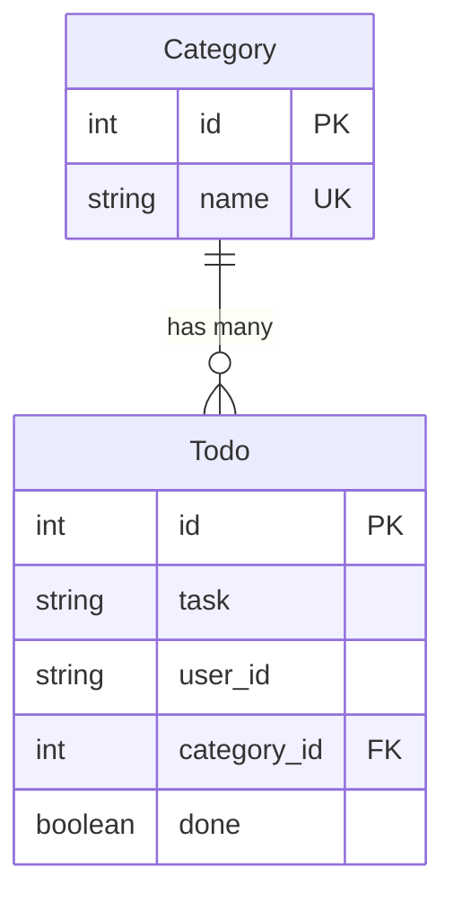

# How to Add Categories to Your Todo App

This guide will walk you through adding categories (like "Urgent" and "Non-urgent") to your todo app. Follow each step carefully and copy the code exactly as shown.

## What We're Building

We're adding a **category system** to organize todos. Each todo must belong to one category (like "Urgent" or "Non-urgent"). Users will select a category from a dropdown menu when creating a new todo. Administrators can add, edit, or delete categories through the admin interface at `/admin/`.

The system uses two database tables with a **one-to-many relationship**: one category can have many todos, but each todo belongs to exactly one category.

---



---

## Step 1: Update `todo.py` - Add the Category Model

### 1.1: Add the Category class

Find the line that says `db = SQLAlchemy(model_class=Base)`.

**Just AFTER** that line, add this new class:

```python
class Category(db.Model):
    __tablename__ = "categories"

    id: Mapped[int] = mapped_column(primary_key=True, init=False)
    name: Mapped[str] = mapped_column(db.String(50), nullable=False, unique=True)

    def __repr__(self): # When you try to print or put this object in a template represent it as it's name
        return self.name


```

### 1.2: Update the Todo class

Find the `Todo` class.

Add a new line after `user_id` to add the category field. And add a new function / method which will make todo.category return the Category object that is linked by the category_id Foreign Key:

```python
class Todo(db.Model):
    __tablename__ = "todos"

    id: Mapped[int] = mapped_column(primary_key=True, init=False)
    task: Mapped[str] = mapped_column(db.String(200), nullable=False)
    user_id: Mapped[str] = mapped_column(db.String(100), nullable=False)
    category_id: Mapped[int] = mapped_column(ForeignKey('categories.id'), nullable=False)
    done: Mapped[bool] = mapped_column(db.Boolean, default=False)

    @property # todo.category is a property (member variable) of the todo object
    def category(self): # return the category object linked to this Todo by category_id
        return Category.query.get(self.category_id)
```

---

## Step 2: Update Routes in `todo.py`

### 2.1: Update the home() function

Find the `home()` function and change it to pass categories to the template:

**New code:**

```python
@todo_bp.route('/')
def home():
    user = get_current_user()
    if not user:
        return render_template('login.html')
    session['user_id'] = user["id"]
    todos = Todo.query.filter_by(user_id=session['user_id']).all()
    categories = Category.query.all()
    return render_template('index.html', todos=todos, categories=categories, user=user)
```

---

### 2.2: Update the add() function

Find the `add()` function and change it to capture the category:

**New code:**

```python
@todo_bp.route('/add', methods=['POST'])
def add():
    if 'user_id' not in session:
        return redirect('/')
    task_text = request.form['task']
    category_id = request.form.get('category_id', type=int)
    if not category_id:
        return redirect('/')
    new_task = Todo(task=task_text, category_id=category_id, user_id=session['user_id'])
    db.session.add(new_task)
    db.session.commit()
    return redirect('/')
```

### 2.3: Update the init_app() function

Find the `init_app()` function at the bottom of `todo.py`. Add code to seed the initial categories:

**New code:**

```python
def init_app(app):
    db.init_app(app)
    with app.app_context():
        db.create_all()
        # Seed initial categories if they don't exist
        if Category.query.count() == 0:
            urgent = Category(name="Urgent")
            non_urgent = Category(name="Non-urgent")
            db.session.add(urgent)
            db.session.add(non_urgent)
            db.session.commit()

        if Todo.query.count() == 0:
            mreggleton_check = Todo(task="Mr Eggleton checking your Todo App!", done=False, user_id="github|5987806", category_id=non_urgent.id)
            db.session.add(mreggleton_check)
            db.session.commit()
```

---

## Step 3: Update `templates/index.html` - Add Category Dropdown

Find the form in `index.html`:

**New code:**

```html
<form method="POST" action="/add">
    <input type="text" name="task" placeholder="Enter task" required>
    <select name="category_id" required>
        <option value="">Select category</option>
        
        <option value="{{ category.id }}">{{ category.name }}</option>
        
    </select>
    <button type="submit">Add</button>
</form>
```

---

Find the task text being printed out and add the category next to it:

**New code:**

```html
            {{ todo.task }} [{{ todo.category }}]
```

---

## Step 4: Update `app.py` - Import Category

Find this line near the top of `app.py`:

```python
from todo import todo_bp, init_app as init_todo 
from todo import db, Todo
```

Change it to:

```python
from todo import todo_bp, init_app as init_todo 
from todo import db, Todo, Category
```

Then find this line near the bottom:

```python
init_admin(app, db, Todo)
```

Change it to:

```python
init_admin(app, db, Todo, Category)
```

---

## Step 5: Update `admin.py` - Add Category Admin View

Find the `init_admin()` function in `admin.py`:

**New code:**

```python
def init_admin(app, db, todo_model, category_model):
    """Attach Babel and register secured admin views for the given models."""
    Babel(app, locale_selector=lambda: 'en')
    admin = Admin(app, name="Admin", template_mode="bootstrap4",
                  index_view=AuthenticatedAdminIndexView())
    admin.add_view(AuthenticatedModelView(todo_model, db.session,
                                          endpoint="todo_admin",
                                          name="Todos"))
    admin.add_view(AuthenticatedModelView(category_model, db.session,
                                          endpoint="category_admin",
                                          name="Categories"))
    return admin
```

---

## Step 6: Reset Your Database

Because you've changed the database structure, you need to delete the old database:

1. Stop your Flask app if it's running (press Ctrl+C in the terminal)
2. Delete the database file from the instance folder.

Restart your Flask app:

```bash
python3 -m flask run --host=localhost --port=5000 
```

The app will create a new database with the "Urgent" and "Non-urgent" categories automatically. Test it on [http://localhost:5000/](http://localhost:5000/)

---

## Testing Your Changes

1. Go to the home page - you should see a dropdown to select a category when adding a task
2. Add a task with a category selected
3. Log in and go to [http://localhost:5000/admin/](http://localhost:5000/admin/) to see the Categories section where you can add, edit, or delete categories

---


## Adding a REST api for modern web techniques

1. Stop your Flask app if it's running (press Ctrl+C in the terminal)

### Step 7: Update `app.py` - 

Find the imports at the top, the last one should be 
`from admin import init_admin` add the following line

```python
from api import api_bp
```

And just after `app.register_blueprint(todo_bp)` add

```python
app.register_blueprint(api_bp)
```

--- 

Restart your Flask app:

```bash
py -m flask run --host=localhost --port=5000 # it maybe python3 on your machine
```

Log in and go to [http://localhost:5000/api/](http://localhost:5000/api/) for
api documentation and a testing environment

---

## Summary of Changes

- **Created** a new `Category` model
- **Added** a foreign key relationship from `Todo` to `Category`
- **Updated** the form to include a category dropdown
- **Modified** the add route to capture the selected category
- **Added** automatic seeding of initial categories
- **Enabled** category management in the admin interface
- **Added** Full REST API with swagger documentation
