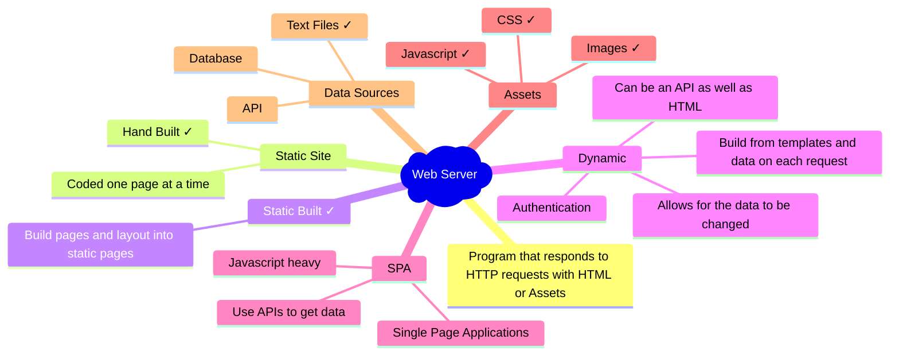
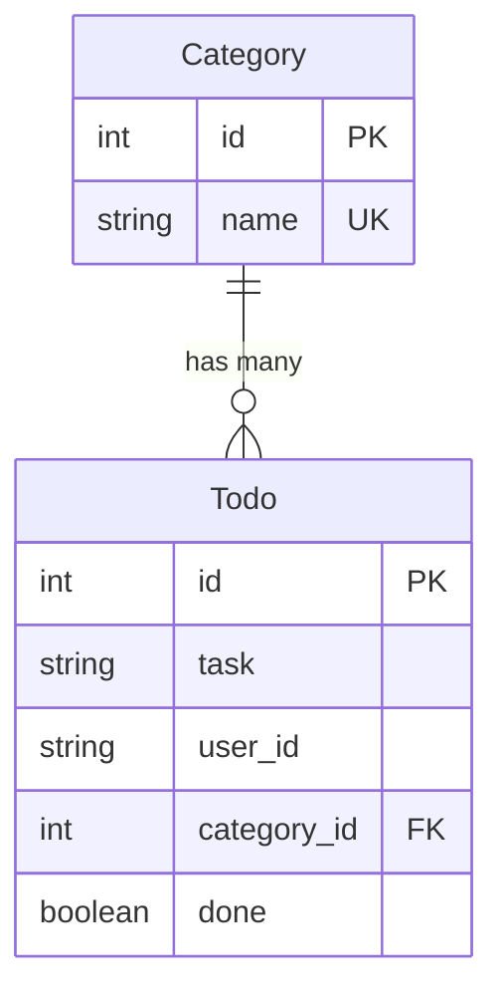

# Python as Dynamic Web Server

---

## Web Tech



---
## Flask Todo App Starter

A simple Python Todo Web App to do some improvements on and be a starting point for your own simple web apps.

## [https://github.com/UTCSheffield/python-flask-todo](https://github.com/UTCSheffield/python-flask-todo)

---

## Features

### Flask

- [Flask](https://flask.palletsprojects.com/en/stable/) based Python Webserver with routing (a function for each url endpoint users can visit)
- HTML / [Jinja templates](https://jinja.palletsprojects.com/en/stable/templates/) for looping though and outputting data and keeping process and display seperate..
- todo.py contains the endpoints for the Todo app

---

### SQLAlchemy & SQLite / PostgreSQL

- SQL Databases the modern way
- Managed by [SQLAlchemy](https://www.sqlalchemy.org/) an ORM /  [Object Relationship Mapper](https://en.wikipedia.org/wiki/Object%E2%80%93relational_mapping) which allows you to write classes that define the data and provides the storage & [CRUD](https://en.wikipedia.org/wiki/Create,_read,_update_and_delete) for you.

---

###  [Object Relationship Mapper](https://en.wikipedia.org/wiki/Object%E2%80%93relational_mapping)

- ORMs build the database for you from your classes so you define what you want to store how it connects together and any extras calculations / functions you need .
- Start with SQLite but you can move to professional systems like PostgreSQL or others when you are ready.
- todo.py includes the Todo class that provides all you need for the building of the database and all the [CRUD](https://en.wikipedia.org/wiki/Create,_read,_update_and_delete).

---

### SQLAlchemy Snippet

```python
class Todo(db.Model):
    __tablename__ = "todos"

    id: Mapped[int] = mapped_column(primary_key=True, init=False)
    task: Mapped[str] = mapped_column(db.String(200), nullable=False)
    user_id: Mapped[str] = mapped_column(db.String(100), nullable=False)
    done: Mapped[bool] = mapped_column(db.Boolean, default=False)
```

---

###  Flask Snippet

```python
@todo_bp.route('/')
def home():
    user = get_current_user()
    if not user:
        return render_template('login.html')

    session['user_id'] = user["id"]
    todos = Todo.query.filter_by(user_id=session['user_id']).all()
    return render_template('index.html', todos=todos, user=user)
```

#### CRUD Admin Snippet

```python
init_admin(app, db, Todo)
```

---

### Authentication (GitHub + Auth0)

Authentication is the act of proving who you are, in this system we use external authentication systems so we aren't storing usernames & passwords (reducing the DPA responsiblilties ). There are still some so we provide a privacy policy.

- GitHub OAuth (Flask-Dance) for local Windows development
- Auth0 OAuth for Codespaces and Render production

---

### Render & Github Actions

- Ready for [Render](https://render.com/)  deployment so you can publish and use the site online for free (there are some speed limitations)
- GitHub Actions CI/CD to build the site when you commit a working version
- Can be upgraded to use a free PostgreSQL database server (but there are some other steps)

---

## Setup

### Start from the Template

1. Login to [github.com](https://github.com/)
2. Go to the github repository [https://github.com/UTCSheffield/python-flask-todo](https://github.com/UTCSheffield/python-flask-todo)
3. Click the green "Use this template" button at the top of the page
4. Select "Create a new repository"
5. Fill in your new repository details:
   - Choose a repository name (e.g., `python-flask-todo`)
   - Add a description (optional)
   - Choose Public or Private visibility
6. Click "Create repository from template"
7. Your new repository will be created with all the template files

---

### Clone your Repository locally

**Using GitHub Desktop:**

1. On the GitHub page for your new repository
2. Click the green "Code" button
3. Click "Open with GitHub Desktop"
4. You may need to login to GitHub Desktop if you haven't already
5. You may be prompted to choose a local path to clone the repository to
6. Click 'Open in Visual Studio Code' to open the project in VS Code

---

## Top Tip

Split screen with the browser with README or LESSON open on one side and VS Code on the other.

---

### Install Dependencies

```bash
py -m pip install -r requirements.txt # You'll need python3 ... in linux
```

---

### Environment Configuration (.env)

In VS Code open `.env.example` and save it as `.env` 

![[SaveAs.png]]

You will need to set **Save as type** to "No Extension (*.)" which is at the bottom of the list

@ UTC Sheffield OLP, Mr Eggleton will give you the contents for the `.env` file that will work with our github setup,

---

## Running the Application

Start the Flask development server:

```bash
py -m flask run --host=localhost --port=5000  # it maybe python3 on your machine
```

The app will be available at [http://localhost:5000](http://localhost:5000)

Try it, login and create a few tasks!

---

## The Database

This code uses [SQLAlchemy](https://www.sqlalchemy.org/) to set up classes that have methods to talk to many [databases](https://docs.sqlalchemy.org/en/20/dialects/index.html). We use **SQLite for simplicity and easy local development**.

---

### Local Development (SQLite)

The database file is stored in `/instance/todo.db`

Hopefully Visual Code has promoted you to install the recommended extensions including the SQLite extension. and so it should appear in the left hand side explorer view with a red icon.

Have a look, can you see the tables and data?

---

## What We're Building Next

Next your going to add a **category system** to organize todos. Each todo must belong to one category (like "Urgent" or "Non-urgent"). Users will select a category from a dropdown menu when creating a new todo. Administrators can add, edit, or delete categories through the admin interface at `/admin/`.

The system uses two database tables with a **one-to-many relationship**: one category can have many todos, but each todo belongs to exactly one category.

---



---

## Step 1: Update `todo.py` - Add the Category Model

### 1.1: Add the Category class

Find the line that says `db = SQLAlchemy(model_class=Base)`.

**Just AFTER** that line, add this new class:

```python
class Category(db.Model):
    __tablename__ = "categories"

    id: Mapped[int] = mapped_column(primary_key=True, init=False)
    name: Mapped[str] = mapped_column(db.String(50), nullable=False, unique=True)

    def __repr__(self): # When you try to print or put this object in a template represent it as it's name
        return self.name


```

---

### 1.2: Update the Todo class

Find the `Todo` class.

Add a new line after `user_id` to add the category field. And add a new function / method which will make todo.category return the Category object that is linked by the category_id Foreign Key:

```python
class Todo(db.Model):
    __tablename__ = "todos"

    id: Mapped[int] = mapped_column(primary_key=True, init=False)
    task: Mapped[str] = mapped_column(db.String(200), nullable=False)
    user_id: Mapped[str] = mapped_column(db.String(100), nullable=False)
    category_id: Mapped[int] = mapped_column(ForeignKey('categories.id'), nullable=False)
    done: Mapped[bool] = mapped_column(db.Boolean, default=False)

    @property # todo.category is a property (member variable) of the todo object
    def category(self): # return the category object linked to this Todo by category_id
        return Category.query.get(self.category_id)
```

---

## Step 2: Update Routes in `todo.py`

### 2.1: Update the home() function

Find the `home()` function and change it to pass categories to the template:

**New code:**

```python
@todo_bp.route('/')
def home():
    user = get_current_user()
    if not user:
        return render_template('login.html')
    session['user_id'] = user["id"]
    todos = Todo.query.filter_by(user_id=session['user_id']).all()
    categories = Category.query.all()
    return render_template('index.html', todos=todos, categories=categories, user=user)
```

---

### 2.2: Update the add() function

Find the `add()` function and change it to capture the category:

**New code:**

```python
@todo_bp.route('/add', methods=['POST'])
def add():
    if 'user_id' not in session:
        return redirect('/')
    task_text = request.form['task']
    category_id = request.form.get('category_id', type=int)
    if not category_id:
        return redirect('/')
    new_task = Todo(task=task_text, category_id=category_id, user_id=session['user_id'])
    db.session.add(new_task)
    db.session.commit()
    return redirect('/')
```

---

### 2.3: Update the init_app() function

Find the `init_app()` function at the bottom of `todo.py`. Add code to seed the initial categories:

**New code:**

```python
def init_app(app):
    db.init_app(app)
    with app.app_context():
        db.create_all()
        # Seed initial categories if they don't exist
        if Category.query.count() == 0:
            urgent = Category(name="Urgent")
            non_urgent = Category(name="Non-urgent")
            db.session.add(urgent)
            db.session.add(non_urgent)
            db.session.commit()

        if Todo.query.count() == 0:
            mreggleton_check = Todo(task="Mr Eggleton checking your Todo App!", done=False, user_id="github|5987806", category_id=non_urgent.id)
            db.session.add(mreggleton_check)
            db.session.commit()
```

---

## Step 3: Update `templates/index.html` - Add Category Dropdown

Find the form in `index.html`:

**New code:**

```html
<form method="POST" action="/add">
    <input type="text" name="task" placeholder="Enter task" required>
    <select name="category_id" required>
        <option value="">Select category</option>
        
        <option value="{{ category.id }}">{{ category.name }}</option>
        
    </select>
    <button type="submit">Add</button>
</form>
```

---

Find the task text being printed out and add the category next to it:

**New code:**

```html
            {{ todo.task }} [{{ todo.category }}]
```

---

## Step 4: Update `app.py` - Import Category

Find this line near the top of `app.py`:

```python
from todo import todo_bp, init_app as init_todo 
from todo import db, Todo
```

Change it to:

```python
from todo import todo_bp, init_app as init_todo 
from todo import db, Todo, Category
```

---

Then find this line near the bottom:

```python
init_admin(app, db, Todo)
```

Change it to:

```python
init_admin(app, db, Todo, Category)
```

---

## Step 5: Update `admin.py` - Add Category Admin View

Find the `init_admin()` function in `admin.py`:

**New code:**

```python
def init_admin(app, db, todo_model, category_model):
    """Attach Babel and register secured admin views for the given models."""
    Babel(app, locale_selector=lambda: 'en')
    admin = Admin(app, name="Admin", template_mode="bootstrap4",
                  index_view=AuthenticatedAdminIndexView())
    admin.add_view(AuthenticatedModelView(todo_model, db.session,
                                          endpoint="todo_admin",
                                          name="Todos"))
    admin.add_view(AuthenticatedModelView(category_model, db.session,
                                          endpoint="category_admin",
                                          name="Categories"))
    return admin
```

---

## Step 6: Reset Your Database

Because you've changed the database structure, you need to delete the old database:

1. Stop your Flask app if it's running (press Ctrl+C in the terminal)
2. Delete the database file from the instance folder.

Restart your Flask app:

```bash
py -m flask run --host=localhost --port=5000 # it maybe python3 on your machine
```

The app will create a new database with the "Urgent" and "Non-urgent" categories automatically. Test it on [http://localhost:5000/](http://localhost:5000/)

---

## Testing Your Changes

1. Go to the home page - you should see a dropdown to select a category when adding a task
2. Add a task with a category selected
3. Log in and go to [http://localhost:5000/admin/](http://localhost:5000/admin/) to see the Categories section where you can add, edit, or delete categories

---

## Adding a REST api for modern web techniques

1. Stop your Flask app if it's running (press Ctrl+C in the terminal)

### Step 7: Update `app.py` - 

Find the imports at the top, the last one should be 
`from admin import init_admin` add the following line

```python
from api import api_bp
```

And just after `app.register_blueprint(todo_bp)` add

```python
app.register_blueprint(api_bp)
```

--- 

Restart your Flask app:

```bash
py -m flask run --host=localhost --port=5000 # it maybe python3 on your machine
```

Log in and go to [http://localhost:5000/api/](http://localhost:5000/api/) for
api documentation and a testing environment

---

## Summary of Changes

- **Created** a new `Category` model
- **Added** a foreign key relationship from `Todo` to `Category`
- **Updated** the form to include a category dropdown
- **Modified** the add route to capture the selected category
- **Added** automatic seeding of initial categories
- **Enabled** category management in the admin interface
- **Added** Full REST API with swagger documentation

---

## Things we are ignoring

- Persistent records in a database. The current database will be destroyed each time you push to render,  ( You can modify the code once it's on Render to move to PostgreSQL ).
- Changing database structure SQLAlchemy Migrations. Currently we aren't handling changes to the database structure so you need to delete the local .db and start again (render wil do this anyway on a rebuild as mentioned above). They can be handled with Migrations
- Minimal Autorisation all Authenticated users can do everything on the site.

---

## Things we are ignoring 2

- Storing any user data in a database (other than an id from github or Auth0 ). To have users on this system to store any other PII refer to [https://flask-dance.readthedocs.io/en/latest/storages.html#sqlalchemy](https://flask-dance.readthedocs.io/en/latest/storages.html#sqlalchemy) and change the privacy statement.
- Testing. There are no tests in this code, although Flask, SQL Alchemy and the other libraries used are thoroughly tested and are checked for security issues.

---

## Your Development

Then what could you make with the same ideas but different entities (things)?

Books and People could make a library etc ....
